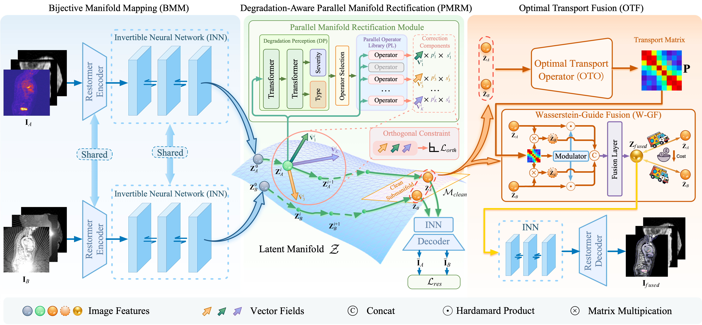

# PROM-Fusion
Medical image restoration and fusion under composite degradations is a persistent challenge in real clinical settings, where multiple degradations frequently co-occur and interact. This problem is commonly addressed using a restore-then-fuse strategy. However, such approaches rely on a fixed degradation processing order, resulting in order dependency and instability particularly when degradations are coupled. In this work, we propose PROM-Fusion, a unified restoration and fusion framework that explicitly removes order dependency under composite degradations. Instead of separating restoration and fusion, PROM-Fusion models degradation removal as a continuous feature rectification process within a shared latent manifold space. An invertible neural network maps features into a structured manifold, where composite degradations are viewed as local feature shifts. We introduce a Parallel Manifold Rectification mechanism that corrects these shifts through simultaneous multi-directional updates, resulting in order-invariant restoration. For cross-modal integration, we formulate fusion as an optimal transport problem. By computing a Wasserstein-based transport plan between modality-specific feature distributions, our method establishes explicit global correspondence and performs structured feature reorganization. This mechanism enhances complementary information while suppressing redundant features. Extensive experiments on multiple multimodal medical datasets demonstrate that PROM-Fusion achieves superior restoration stability and enhanced fusion quality under composite degradation conditions, consistently outperforming state-of-the-art serial and all-in-one approaches.

